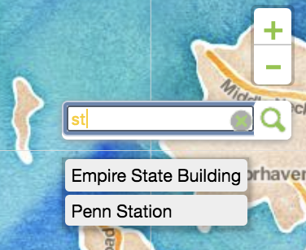

# Community Projects Map

This project was done on a pro-bono basis for a non-profit looking to explore possibilities for mapping their community projects. The organization was looking for a colorful, easy to maintain map.

Features:
All marker data is stored in an easily accessible Google spreadsheet. This gave the organization direct access to updating the data without having to update the app's javascript files. We used Tabeltop.js to achieve this.


## Technologies used:

JavaScript, HTML5, CSS3, Leaflet.js, Mapbox, Tabletop.js

## Process/approach:

Discuss overall functionality and purpose with client

Whiteboard basic concept

Create wireframe using InVision and get client input

Create assets using Adobe Illustrator (markers, logo)

Create app and refine style with client input

Optimize images and files (compression, minification, etc.)


## Code Snippets

#### Integration of Tabletop.js to allow client easy access to marker data

```
app.js

...

Tabletop.init({
  key: code,
  callback: function(sheet, tabletop) {

    var sheet1 = tabletop.sheets("Sheet1").elements;
    legend = document.getElementById("category-title");
    iconArray = [];

    for (var i in sheet1) {
      var data = sheet1[i];
      lat = +(data.latitude);
      lng = +(data.longitude);

      var icon = L.icon({
        iconUrl: data.icon,
        iconSize: [25, 25],
      });

      var title = data.name, //value searched
        category = data.category,
        loc = [lng, lat],
        marker = new L.Marker(new L.latLng(loc), {
          title: title,
          category: category,
          icon: icon
        }); // property searched
      marker.bindPopup("<strong>" + title + "</strong><br>" +
        data.description + " | " + data.city + "<br>Issue: " + data.category);
      markersLayer.addLayer(marker);
      iconArray.push(data.icon);

      //crete legend for each current project
      var el = document.createElement("ul");
      el.innerHTML = "<span>" + " " + data.category + "</span>";
      legend.appendChild(el);
      //add images
      var x = document.createElement("IMG");
      x.setAttribute("src", data.icon);
      x.setAttribute("width", "14");
      x.setAttribute("height", "14");
      x.setAttribute("alt", "marker icon");
      el.prepend(x);
      var caption = document.createElement("figcaption");
      caption.innerHTML = "<span>" + data.name + "</span>";
      el.append(caption);
      var layerNamesFromSpreadsheet = [];
      var pointLayerNameFromSpreadsheet = data.category;
      layerNamesFromSpreadsheet.push(pointLayerNameFromSpreadsheet);
    }
  },
  simpleSheet: true
})

function initInfoPopup(info, coordinates) {
  L.popup({
      className: "intro-popup"
    })
    .setLatLng(map.getCenter())
    .setContent("<p>Welcome to Community Projects Map</p>" + "<br/>")
    .openOn(map);

}

```
#### Client has access to update data via Google spreadsheet


#### Search capabilities for marker data

```
app.js

var controlSearch = new L.Control.Search({
  layer: markersLayer,
  initial: false,
  zoom: 15,
  marker: false,
  position: "topright",
  textPlaceholder: "search projects..."
});

```



#### Add map and Stamen style

```
app.js

...

var map = L.map("map", {
  minZoom: 9,
  maxZoom: 18
}).setView([40.749844, -73.98994], 12);
if (map.tap) {
  map.tap.disable();
}
L.tileLayer("https://stamen-tiles.a.ssl.fastly.net/watercolor/{z}/{x}/{y}.jpg", {
  attribution: 'Map tiles:<a href="http://stamen.com"> Stamen Design</a> Data:<a href="https://openstreetmap.org"> OpenStreetMap</a> Design: <a href="https://juancarlucci.github.io/resume/"> Juan Carlos Collins</a>',
  zoomControl: true,
}).addTo(map);
map._layersMinZoom = 6;
map.zoomControl.setPosition("topright");

```


#### CSS3 variables for code maintainability

  ```
index.css

:root {
  /* // Color Scheme */
  --background-color: #ffffff;
  --main-color: #89c63b;
  --secondary-color: #fbcc02;
  --accent-color: #005bab;

  /* // Sizing/* --base: 16px; */
  --tiny-spacing: var(--base * 0.25);
  --small-spacing: var(--base * 0.5);
  --default-spacing: var(--base);
  --large-spacing: var(--base * 2);
  */

}

```

### Adobe Illustrator for creating markers


